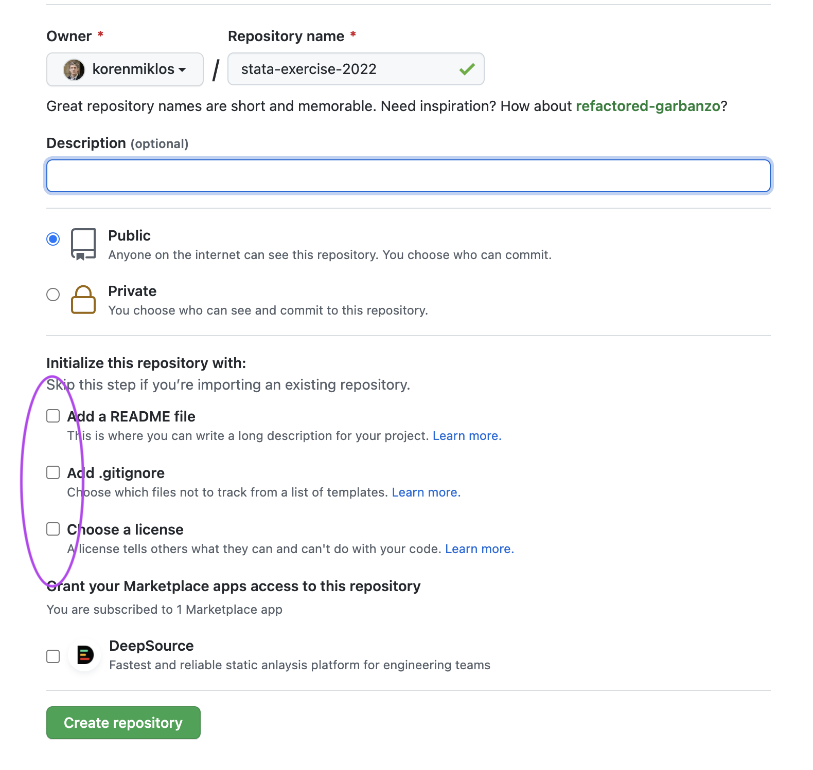
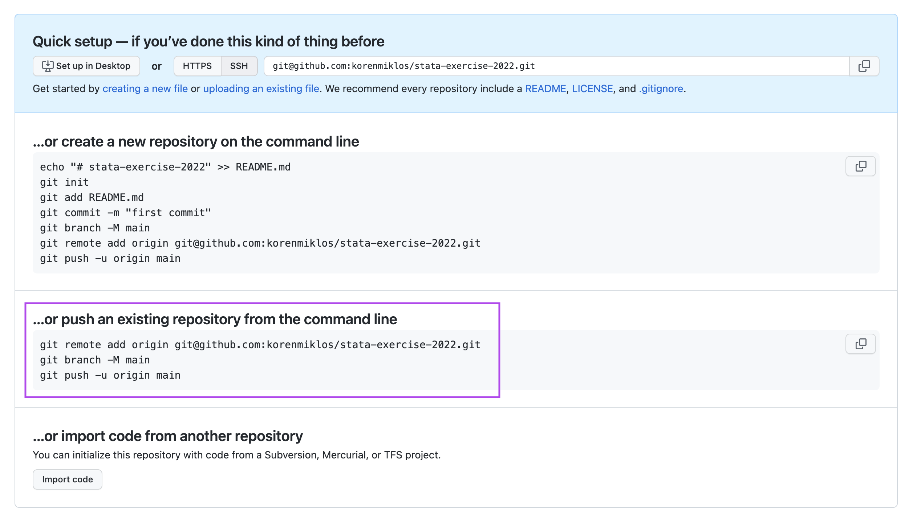

## How to push an existing repo to GitHub
After you have created a new git repo on your local computer with `git init` and commited a bunch of commits, here's how you can push this repo to GitHub.

First, create an *empty* repo on GitHub. It has to be totally empty, so make sure not to check any of the boxes on the repo creation screen.

Once you click *Create repository*, you will see a set of commands to copy to yout command line (Git Bash if on Windows). Copy and paste them, which should 
1. connect your repo to GitHub
2. push the changes you have made locally

After this, git already knows about the server, so you can use `git pull` and `git push` as usual.